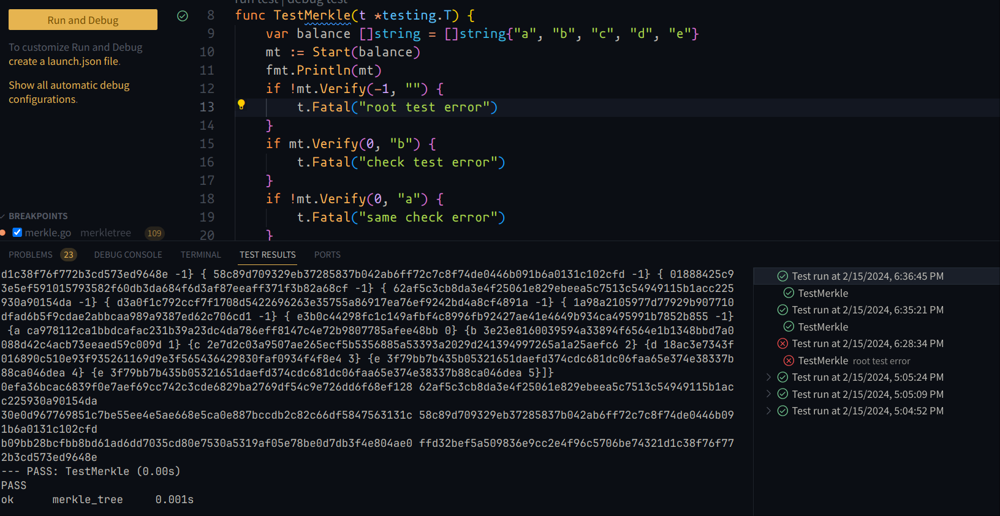
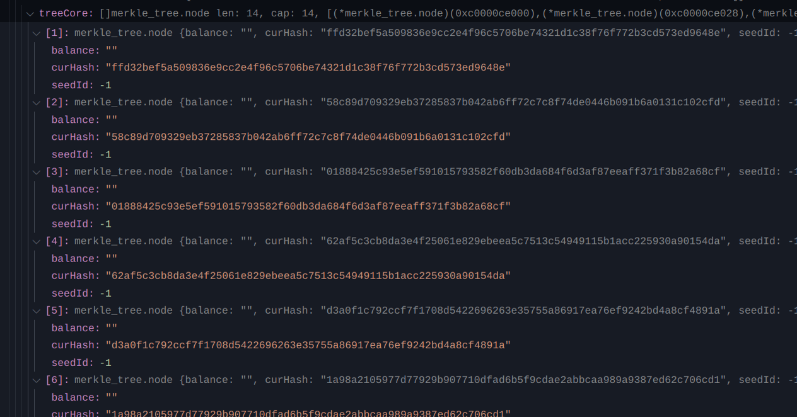
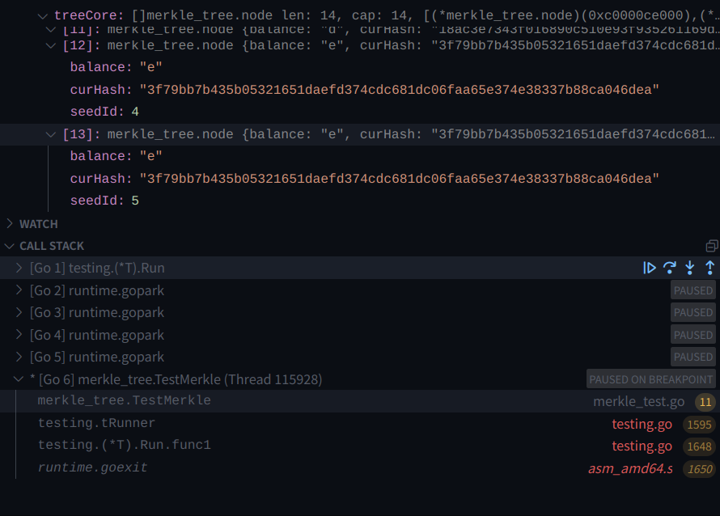
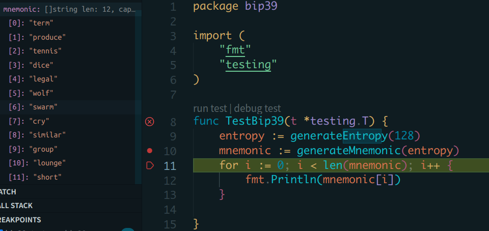
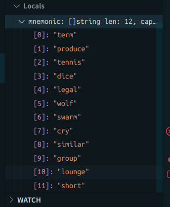
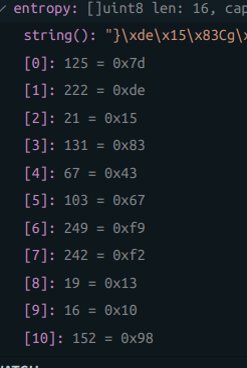
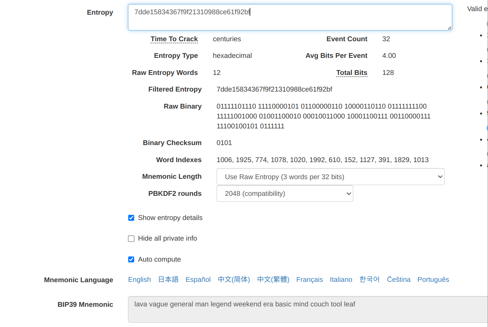
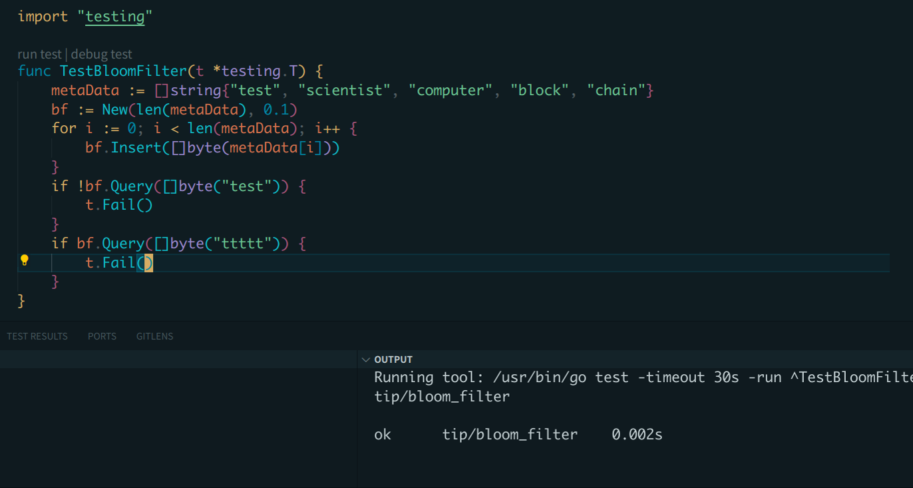

# 随手笔记和代码
写一些小知识点
## markle tree
默克尔树又叫hash树，本质就是一个完全二叉树,因此实现起来还是比较容易
```go
package merkletree

import (
	"crypto/sha256"
	"encoding/hex"
	"fmt"
)

// 因为完全二叉树的性质，且在区块中一旦确定交易数量，后续是无法改变树上节点数的，因此用固长的数组反而更加容易？

// 这个 balance 可以是任何类型的账单数据，或者二进制，json
type node struct {
	balance string // 这里简单用string表示
	curHash string
	seedId  int //if seed id == -1 not seed
}

type MerkleTree struct {
	RootHash string
	treeCore []node
}

// 网上随便找的sha256方法
func GetSHA256HashCode(message []byte) string {
	//方法一：
	//创建一个基于SHA256算法的hash.Hash接口的对象
	hash := sha256.New()
	//输入数据
	hash.Write(message)
	//计算哈希值
	bytes := hash.Sum(nil)
	//将字符串编码为16进制格式,返回字符串
	hashCode := hex.EncodeToString(bytes)
	//返回哈希值
	return hashCode

	//方法二：
	//bytes2:=sha256.Sum256(message)//计算哈希值，返回一个长度为32的数组
	//hashCode2:=hex.EncodeToString(bytes2[:])//将数组转换成切片，转换成16进制，返回字符串
	//return hashCode2
}

var cur int

func createTree(balances []string, index int, treeCore []node) string {
	if index >= len(treeCore) {
		return ""
	}
	treeCore[index].seedId = -1
	l := createTree(balances, index<<1, treeCore)
	r := createTree(balances, index<<1|1, treeCore)

	if index*2 >= len(treeCore) && cur < len(balances) {
		// fmt.Println(index, len(treeCore), cur)
		treeCore[index].seedId = cur
		treeCore[index].balance = balances[cur]
		treeCore[index].curHash = GetSHA256HashCode([]byte(balances[cur]))
		cur++
	} else {
		if r == "" {
			r = l
		}
		metaHash := l + r
		treeCore[index].curHash = GetSHA256HashCode([]byte(metaHash))
	}
	return treeCore[index].curHash
}

func bo(n int) int {
	begin := 1
	cnt := n
	for n > begin {
		cnt += begin
		begin *= 2
	}
	return cnt
}

func (mt *MerkleTree) VerifyForRootHash() bool {
	return mt.Verify(-1, "")
}

func (mt *MerkleTree) Verify(seedId int, balance string) bool {
	if seedId >= cur {
		panic("illegal index")
	}
	return mt.query(seedId, 1, balance) == mt.RootHash
}
func (mt *MerkleTree) query(seedId int, index int, balance string) string {
	if index >= len(mt.treeCore) {
		return ""
	}

	l := mt.query(seedId, index<<1, balance)
	r := mt.query(seedId, index<<1|1, balance)
	if mt.treeCore[index].seedId >= 0 {
		if mt.treeCore[index].seedId == seedId {
			return GetSHA256HashCode([]byte(balance))
		} else {
			return mt.treeCore[index].curHash
		}
	} else {
		if r == "" {
			r = l
		}
		metaHash := l + r
		hash := GetSHA256HashCode([]byte(metaHash))
		if hash != mt.treeCore[index].curHash {
			fmt.Println(hash, mt.treeCore[index].curHash)
		}
		return hash
	}
}

func Start(balances []string) *MerkleTree { //初始化位置 给定账单长度
	if len(balances) == 0 {
		panic("nil!")
	}
	if len(balances)&1 != 0 {
		balances = append(balances, balances[len(balances)-1])
	}
	len := bo(len(balances))
	treeCore := make([]node, len+1)
	createTree(balances, 1, treeCore)

	merkle := MerkleTree{
		RootHash: treeCore[1].curHash,
		treeCore: treeCore,
	}
	return &merkle
}

```
简单做了下test






## Merkle Patricia Trie

https://ethereum.org/en/developers/docs/data-structures-and-encoding/patricia-merkle-trie

这个数据结构简而言之，Merkle树加上伸缩字典树（Patricia Trie）, 但我个人觉得随着数据量的增多（尤其是eth这种），伸不伸缩意义已经不大了，空桶的数量反而成为了少数


## 助记词原理

助记句（“助记代码”，“种子短语”，“种子词”）是一种将大量随机生成的数字表示单词序列的方法， 使其更易于人类存储。

## generate mnemonic 
遵循bip39标准： https://github.com/bitcoin/bips/blob/master/bip-0039.mediawiki

理解助记词,首先知道官方文档这句话就行了：

This guide is meant to be a way to transport computer-generated randomness with a human-readable transcription. It's not a way to process user-created sentences (also known as brainwallets) into a wallet seed.

助记词不是将任意的单词转换wallet seed，也不是通过编码的方式将生成的一系列连续的数字转换成单词（当我第一次听到助记词这个概念的时候我以为是将生成后的数字，通过ascii或者utf之类将其转化为字符，然后就很困惑，它怎么能够保证生成的单词是正确拼写，看了文档后才发现不是我这样想的）。

它的生成原理：

First, an initial entropy of ENT bits is generated. A checksum is generated by taking the first ENT / 32 bits of its SHA256 hash. This checksum is appended to the end of the initial entropy. Next, these concatenated bits are split into groups of 11 bits, each encoding a number from 0-2047, serving as an index into a wordlist. Finally, we convert these numbers into words and use the joined words as a mnemonic sentence.

它将生成的随机数字按照11bit(The mnemonic must encode entropy in a multiple of 32 bits. 加上cs位，始终会生成3*n个助记词)为一组变成了0-2047的索引，然后有个wordlist，里面有对应的单词，原理就变得简单了

The following table describes the relation between the initial entropy length (ENT), the checksum length (CS), and the length of the generated mnemonic sentence (MS) in words.
<pre>
CS = ENT / 32
MS = (ENT + CS) / 11

|  ENT  | CS | ENT+CS |  MS  |
+-------+----+--------+------+
|  128  |  4 |   132  |  12  |
|  160  |  5 |   165  |  15  |
|  192  |  6 |   198  |  18  |
|  224  |  7 |   231  |  21  |
|  256  |  8 |   264  |  24  |
</pre>

#### code

code 参考了官方的：https://github.com/tyler-smith/go-bip39

这里注意BigInt采用大端法生成


代码实现
```go
package bip39

import (
	"crypto/rand"
	"crypto/sha256"
	"math/big"
)

// The allowed size of ENT is 128-256 bits
func generateEntropy(bitSize int) []byte {
	if bitSize < 128 || bitSize > 256 || bitSize%32 != 0 {
		panic("bad arg!")
	}
	entropy := make([]byte, bitSize/8)
	rand.Read(entropy)
	return entropy
}

func generateMnemonic(entropy []byte) string {
	entLen := len(entropy) * 8
	csLen := entLen / 32
	msLen := (entLen + csLen) / 11

	hasher := sha256.New()
	hasher.Write(entropy)
	hash := hasher.Sum(nil)
	csByteGet := hash[0]
	bigTwo := big.NewInt(2)
	bigOne := big.NewInt(1)
	dataBigInt := new(big.Int).SetBytes(entropy)
	for i := 0; i < csLen; i++ {
		dataBigInt.Mul(dataBigInt, bigTwo)
		if csByteGet&(1<<(7-i)) != 0 {
			dataBigInt.Or(dataBigInt, bigOne)
		}
	}

	mnemonic := make([]string, msLen)
	index := big.NewInt(0)
	//2048
	save := big.NewInt(2047)
	mod := big.NewInt(2048)
	for i := msLen - 1; i >= 0; i-- {
		index.And(save, dataBigInt)
		mnemonic[i] = English[index.Int64()]
		dataBigInt.Div(dataBigInt, mod)
	}
	for i := 0; i < msLen; i++ {
		if i != 0 {
			result += " "
		}
		result += mnemonic[i]
	}
	return result
}


```









### From mnemonic to seed 

A user may decide to protect their mnemonic with a passphrase. If a passphrase is not present, an empty string "" is used instead.

To create a binary seed from the mnemonic, we use the PBKDF2 function with a mnemonic sentence (in UTF-8 NFKD) used as the password and the string "mnemonic" + passphrase (again in UTF-8 NFKD) used as the salt. The iteration count is set to 2048 and HMAC-SHA512 is used as the pseudo-random function. The length of the derived key is 512 bits (= 64 bytes).


### code
```go
func generateSeed(mnemonic string, passphrase string) []byte {
	return pbkdf2.Key([]byte(mnemonic), []byte("mnemonic"+passphrase), 2048, 64, sha512.New)
}
```

该种子稍后可用于使用 BIP-0032(这个和BIP-0044一起在后面写吧) 或类似方法生成确定性钱包。

## ERC4337

https://eips.ethereum.org/EIPS/eip-4337

## Bloom Filter

布隆过滤器,在之前居然没有听说过这个数据结构，本身原理还是很简单的。它的使用范围也很简单：设想一个这样的场景我们有一堆大数据，然后验证一个大数据是否存在于其中。我们首先相当的肯定是将这堆数据以红黑树的形式存起来或者hash表，前者查找效率为o(logn),后者为o(1)，非常的优秀，但是我们却忽略了存储的问题，大数据是有可能导致存储超限，存不进去的。

那如何解决呢？bloom filter就有`概率`解决这个问题，其本质是bitset(虽然看网上一些人的文档为bitmap,但其实bitset感觉更准确一点，它只能验证是否存在)+多次hash，对于一个数据我们进行`k`次hash,每次hash除原始数据外加上一个固定增量，使几次hash结果不同，得到几个不同的key,然后在bitset上面验证这些key是否都存在，如果都存在，如果存在则有概率认为该数据存在（为什么是概率认为，因为可能有其他数据的keys叠加在一起，使那几个key对应的值都存在）

这是wiki上面的关于bit长度和散列次数的最佳位置的推导（没有看数学证明）:

bit数组长度 m

散列函数个数 k

预期元素数量 n

期望误差 ε


在go-zero里面实现bloom filter使用的MurmurHash3,因为不太了解这个函数所以使用了sha256实现

### code

```go
package bloom_filter

import (
	"crypto/sha256"
	"math"
	"math/big"
)

type BloomFilter struct {
	bitSet  []byte
	hashLen int
}

const Itor = 114

var bitLen *big.Int

func New(n int, expect float64) *BloomFilter {
	m := int(-float64(n) * math.Log(expect) / math.Pow((math.Ln2), 2))
	k := int(float64(m) / float64(n) * math.Ln2)
	bloomFilter := &BloomFilter{
		bitSet:  make([]byte, (m+7)/8),
		hashLen: k,
	}
	bitLen = big.NewInt(int64(m))
	return bloomFilter
}

func (bloomFilter *BloomFilter) Insert(element []byte) {
	hasher := sha256.New()
	temp := make([]byte, len(element))
	copy(temp, element)
	for i := 0; i < bloomFilter.hashLen; i++ {
		temp = append(temp, byte(Itor))
		hasher.Write(temp)
		hash := hasher.Sum(nil)
		dataBigInt := new(big.Int).SetBytes(hash)
		dataBigInt.Mod(dataBigInt, bitLen)
		bloomFilter.bitSet[dataBigInt.Int64()/8] |= (1 << byte(dataBigInt.Int64()%8))
	}
}

func (bloomFilter *BloomFilter) Query(element []byte) bool{
	hasher := sha256.New()
	temp := make([]byte, len(element))
	copy(temp, element)
	cnt := 0
	for i := 0; i < bloomFilter.hashLen; i++ {
		temp = append(temp, byte(Itor))
		hasher.Write(temp)
		hash := hasher.Sum(nil)
		dataBigInt := new(big.Int).SetBytes(hash)
		dataBigInt.Mod(dataBigInt, bitLen)
		if bloomFilter.bitSet[dataBigInt.Int64()/8]&(1<<byte(dataBigInt.Int64()%8)) != 0 {
			cnt++
		}
	}
	return cnt == bloomFilter.hashLen
}

```

